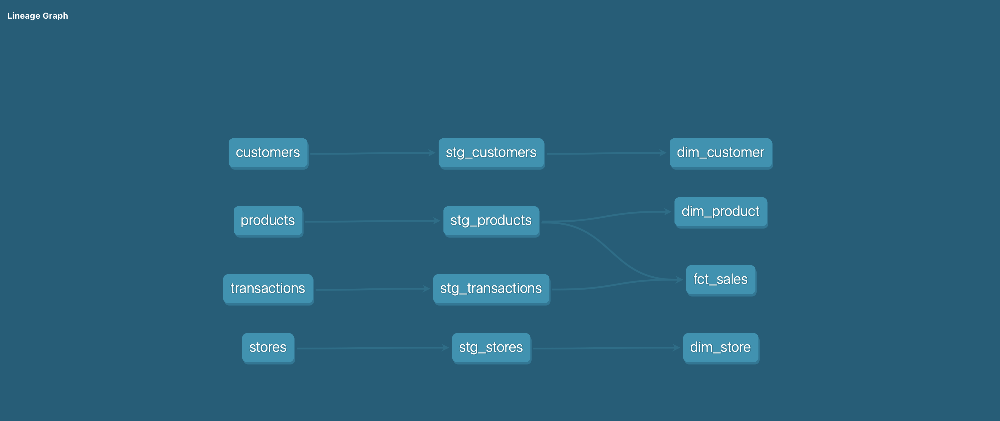
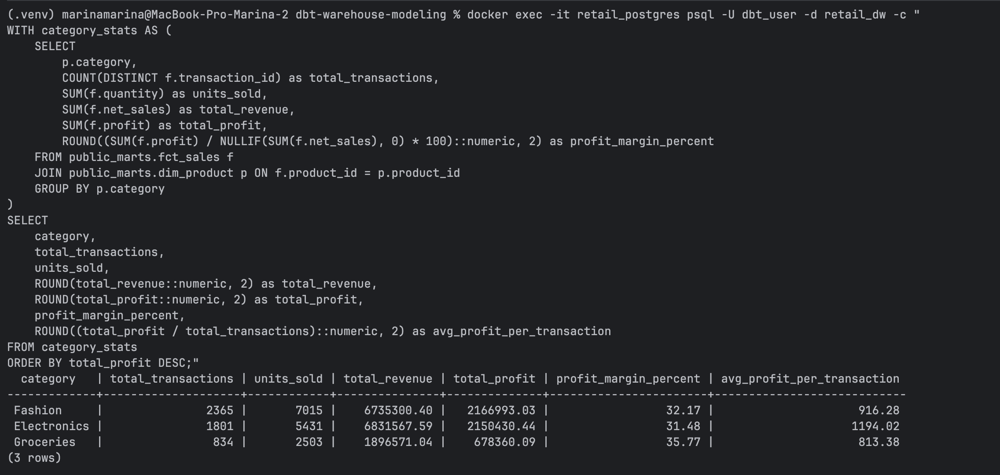
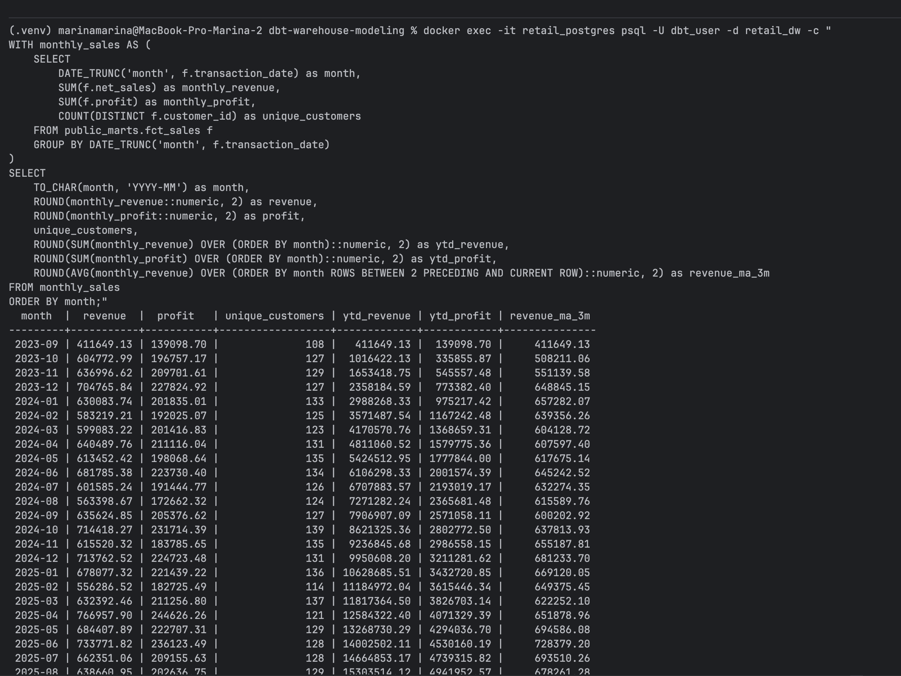
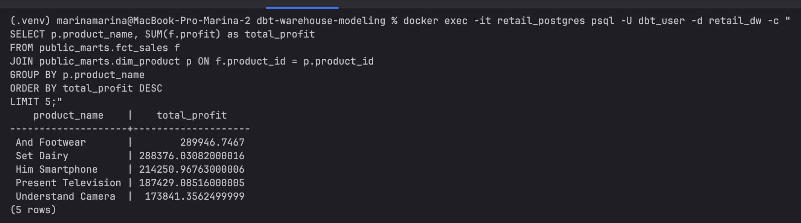

# dbt-warehouse-modeling

A production-ready data warehouse project built with **dbt**, **PostgreSQL**, and **Docker**.  
Demonstrates **dimensional modeling (star schema)** with staging and marts layers, data quality tests, and automated documentation.

---
## Dataset Source

This project uses the Retail Sales Dataset from Kaggle:

👉 Retail Sales Dataset https://www.kaggle.com/datasets/buharishehu/retail-sales-dataset/data

The dataset includes:
4 tables (customers, products, stores, transactions)
5,000+ transactions
Realistic business relationships (star schema ready)

## 🎯 Project Overview

This project simulates a retail business environment with:

- **4 source tables** (customers, products, stores, transactions)
- **Staging layer** – Data cleaning, renaming, and type casting
- **Marts layer** – Star schema with facts (`fct_sales`) and dimensions (`dim_customer`, `dim_product`, `dim_store`)
- **dbt tests** – `unique` and `not_null` constraints
- **Auto-generated documentation** with lineage graph

---

## 🧱 Architecture

### Staging → Marts (Star Schema)



| Layer | Description |
|-------|-------------|
| **Staging** | Light transformations, column renaming, data type conversion |
| **Marts** | Business-ready facts and dimensions (star schema) |

### Schemas

- `public` – Raw seed data (CSV imports)
- `public_staging` – Cleaned staging views
- `public_marts` – Final star schema (facts & dimensions)

---

## 🛠 Tech Stack

| Tool | Purpose |
|------|---------|
| **dbt** | SQL transformations, testing, docs |
| **PostgreSQL** | Data warehouse (Dockerized) |
| **Docker** | Containerized development environment |
| **Git** | Version control |

---
## 🤔 Why PostgreSQL instead of Snowflake / BigQuery?

| Consideration | PostgreSQL (chosen) | Snowflake / BigQuery |
|---------------|----------------------|----------------------|
| Local development | ✅ Runs in Docker | ❌ Cloud-only |
| Cost | ✅ Free | 💰 Pay-per-use |
| Portfolio demo | ✅ Anyone can clone & run | ❌ Requires cloud account |
| Production scale | ❌ Limited | ✅ Petabyte-scale |

**The key point:**  
The dbt models (`staging/*.sql`, `marts/*.sql`) are **fully portable**. The same SQL logic would run on Snowflake or BigQuery with **zero changes** – only the `profiles.yml` connection settings would need to be updated.

This project focuses on **data modeling best practices**, not infrastructure. The star schema, tests, and documentation are cloud-agnostic by design.


---

## 📊 Sample Analytics

### 1. Profit by Product Category

Shows total revenue, profit, and profit margin per category.



### 2. Monthly Revenue with YTD and 3-Month Moving Average

Time-series analysis with cumulative metrics and rolling averages.



### 3. Top-5 products

---

## 🚀 How to Run Locally

### Prerequisites

- Docker & Docker Compose installed
- Git

### Steps

```bash
# 1. Clone the repository
git clone https://github.com/marinashtrassheim/dbt-warehouse-modeling.git
cd dbt-warehouse-modeling

# 2. Start containers
docker-compose up -d --build

# 3. Load data into PostgreSQL
docker exec -it retail_dbt bash -c "cd /usr/app/retail_project && dbt seed"

# 4. Build staging and marts models
docker exec -it retail_dbt bash -c "cd /usr/app/retail_project && dbt run"

# 5. Run data quality tests
docker exec -it retail_dbt bash -c "cd /usr/app/retail_project && dbt test"

# 6. Generate documentation
docker exec -it retail_dbt bash -c "cd /usr/app/retail_project && dbt docs generate"

# 7. Serve documentation locally
docker exec -it retail_dbt bash -c "cd /usr/app/retail_project && dbt docs serve --port 8080 --host 0.0.0.0"
